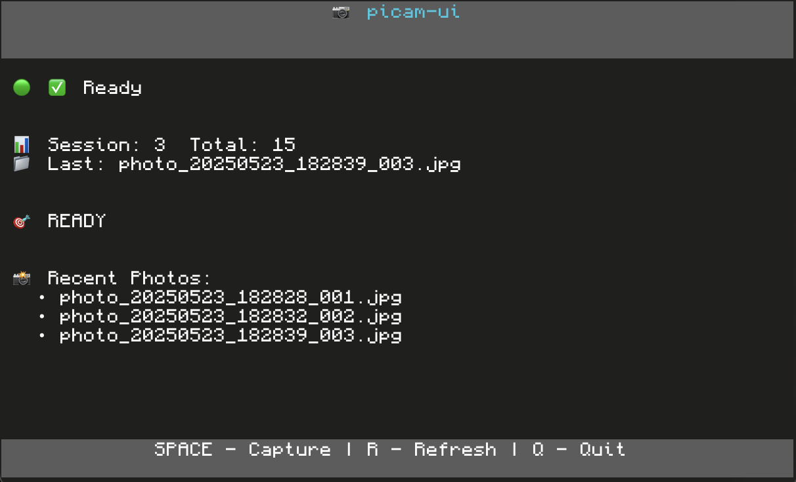

# picam-ui

Simple terminal interface for rapid photo capture with Raspberry Pi camera module.

## ⚠️ Important: Virtual Environment Setup

**You MUST use a virtual environment with system site packages to access picamera2:**

```bash
python3 -m venv --system-site-packages .venv
source .venv/bin/activate
pip install -r requirements.txt
```

Regular virtual environments (`python3 -m venv .venv`) will NOT work with picamera2 as it requires system-level camera access.

## Preview



## Features

- 🎨 Clean terminal UI with Textual
- 📊 Live statistics and photo tracking
- 📸 One-key photo capture (spacebar)
- 📁 Automatic timestamped filenames
- 🕒 Recent photos display
- 🚀 Fast camera initialization feedback

## Quick Start

1. **Create virtual environment with system packages**:
   ```bash
   python3 -m venv --system-site-packages .venv
   source .venv/bin/activate
   ```

2. **Install dependencies**:
   ```bash
   pip install -r requirements.txt
   ```

3. **Run the application**:
   ```bash
   python3 main.py
   ```

4. **Take photos**:
   - Press **SPACEBAR** to capture
   - Press **R** to refresh stats
   - Press **Q** to quit

## Usage

### Basic Usage
```bash
python3 main.py
```
Photos saved to `photos/` directory.

### Custom Output Directory
```bash
python3 main.py /path/to/custom/directory
```

### File Naming
Photos are automatically named:
```
photo_YYYYMMDD_HHMMSS_XXX.jpg
```

Example:
```
photos/
├── photo_20241215_143022_001.jpg
├── photo_20241215_143025_002.jpg
└── photo_20241215_143028_003.jpg
```

## Controls

| Key | Action |
|-----|--------|
| `SPACEBAR` | Take a picture |
| `R` | Refresh statistics |
| `Q` | Quit application |

## Requirements

- Raspberry Pi with camera module
- Python 3.7+
- picamera2 (system package)
- textual

## Installation

**Important**: Use virtual environment with system site packages:

```bash
python3 -m venv --system-site-packages .venv
source .venv/bin/activate
pip install -r requirements.txt
```

## Interface

The Textual-based interface shows:
- Camera status with real-time initialization progress
- Session and total photo counts
- Last photo taken
- Recent photos list (last 5)
- Live capture status indicator
- Clean, stable layout that works on all terminals